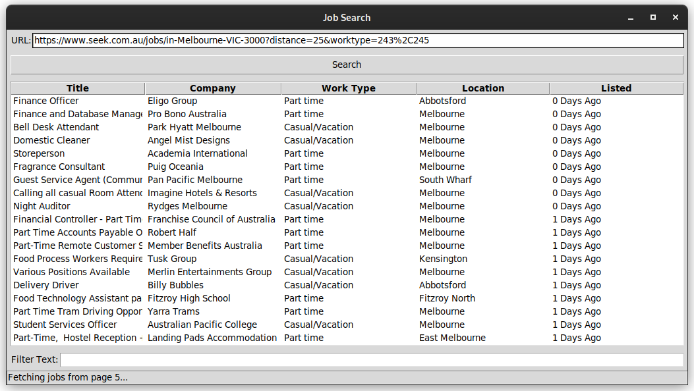

<div align="center">
    
</div>

### Setup
```sh
# Clone source code
git clone https://github.com/Cxmrykk/Seek-GUI.git
cd Seek-GUI

# Setup virtual environment
python3 -m venv venv
source venv/bin/activate

# Install Python dependencies
pip install selenium

# Execute the program
python -m scraper
```

### Getting a URL
- Visit [Seek.com.au](https://seek.com.au/) and create a job search query
- Copy the browser URL after the page has loaded
- Paste into the "URL" field and click "Search"
