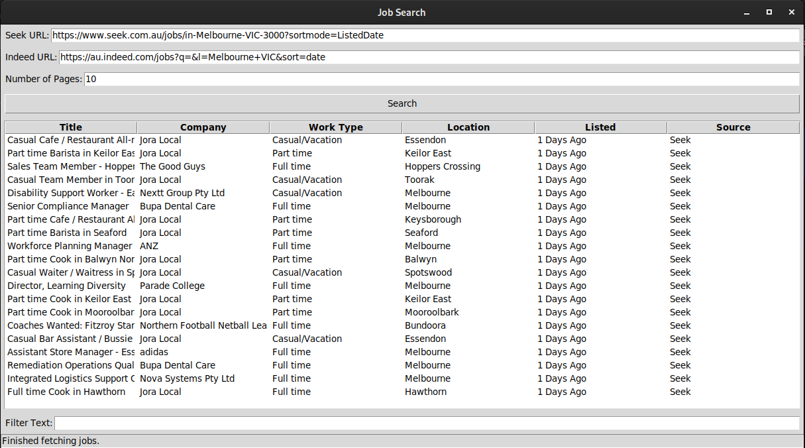

<div align="center">
    <h2>Jobs GUI</h2>
    <p>GUI for Seek and Indeed - Save time browsing jobs</p>
    
</div>

### Prerequisites
- [Chromium](https://www.chromium.org/getting-involved/download-chromium/)
- [Chromedriver](https://developer.chrome.com/docs/chromedriver/downloads)
- [Python 3 and pip](https://www.python.org/downloads/)

### Setup (Linux)
```sh
# Clone the project
git clone https://github.com/Cxmrykk/Jobs-GUI.git
cd Jobs-GUI

# Setup and enter Python virtual environment
python3 -m venv venv
source venv/bin/activate

# Install Python 3P dependencies
pip install undetected-chromedriver

# Run the GUI
python -m scraper
```

### Usage
1. Visit [seek.com.au](https://seek.com.au/) or [au.indeed.com](https://au.indeed.com) in your browser and create a job search query
2. Copy the browser URL(s) after searching for your query
3. Open the GUI, paste contents into the "URL" field and click "Search"

A chromium window will open and scrape the page contents (leave this window open until it closes automatically)